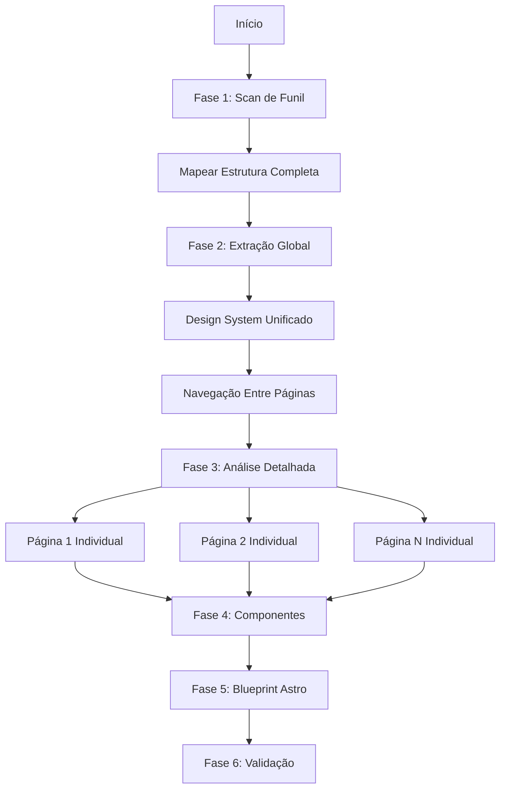
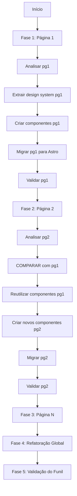
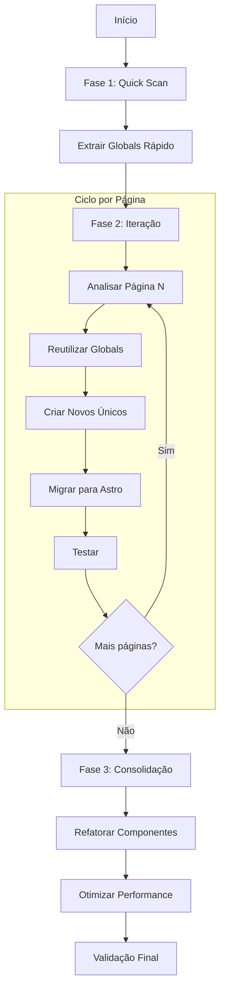

# 🎯 Opções de Workflow: Migração de Funis DR para Astro

**Contexto:** Adaptação do Design System Workflow para produtos Direct Response (Will Offer, Natal-Feliz, futuros produtos)

**Framework Alvo:** Astro + React + TailwindCSS

---

## 📊 Análise do Contexto Atual

### Estrutura de Produtos DR

```
[PRODUTO-DR]/
├── stitch/              # Páginas clonadas/exportadas (Natal-Feliz)
│   ├── pg1-quiz/        # Cada pasta = 1 etapa do funil
│   │   ├── index.html
│   │   ├── css/
│   │   ├── js/
│   │   ├── images/
│   │   └── fonts/
│   └── pg2-resgatar/
│       └── [mesma estrutura]
│
├── paginas/             # Funil HTML atual (Will-Offer)
│   ├── index.html       # Landing page
│   ├── 2/, 3/, ..., 7/  # Etapas do funil
│   └── up1/, ..., up12/ # Upsells
│
├── criativos/           # Assets de marketing
├── assets/              # Assets reutilizáveis
└── docs/                # Documentação
```

### Padrões Comuns Identificados

✅ **Multi-página de funil** (não página única)  
✅ **Assets organizados** por pasta/etapa  
✅ **Tracking scripts inline** (Facebook Pixel, GTM, UTMify)  
✅ **Navegação sequencial** entre etapas  
✅ **Migração Astro** como framework alvo  
✅ **React Islands** para interatividade  
✅ **TailwindCSS** para estilos  

---

## 🎨 OPÇÃO 1: Workflow Hierárquico (Funil-First)

### 🎯 Filosofia
Análise **top-down**: entende o funil completo primeiro, depois detalha cada página.

### 📁 Estrutura de Input

```
[PRODUTO]/stitch/     OU    [PRODUTO]/paginas/
├── pg1-*/                  ├── index.html
├── pg2-*/                  ├── 2/
└── pg3-*/                  └── up1/
```

### 🔄 Fluxo do Workflow



### 📋 Fases Detalhadas

#### **Fase 1: Mapeamento do Funil Completo**

```markdown
TAREFA DO AGENTE: Escanear TODAS as pastas em `/stitch` ou `/paginas` e criar mapa do funil.

INPUT: Raiz do produto (ex: `natal-feliz/stitch/` ou `will-offer/paginas/`)

ANALISAR:
- **Estrutura do Funil**: Ordem das páginas (pg1 → pg2 → pg3 ou index → 2 → up1)
- **Nomenclatura**: Padrão de nomes (pgN, upN, números)
- **Assets Compartilhados**: CSS/JS/images usados em múltiplas páginas
- **Tracking Scripts**: Facebook Pixel, GTM, UTMify por página
- **Navegação**: Links entre páginas, CTAs, forms actions

CRIAR ARQUIVO: `/docs/funil-map.md`

FORMATO:
# Mapa do Funil - [Nome do Produto]

## Estrutura do Funil
Landing → PG1 → PG2 → Checkout

## Páginas Identificadas
| Ordem | Pasta | Tipo | Assets | Tracking |
|-------|-------|------|--------|----------|
| 1 | pg1-quiz/ | Quiz Lead Capture | 13 arquivos | FB Pixel, UTMify |
| 2 | pg2-resgatar/ | Resgate Oferta | 11 arquivos | FB Pixel, UTMify |

## Navegação Entre Páginas
- pg1 → pg2: Botão "Resgatar agora" (onclick redirect)
- pg2 → checkout: Form submit action

## Assets Compartilhados
- Fonts: Montserrat (usado em TODAS)
- Logo: SadiaLogo.png (header de TODAS)
- CSS Reset: Tailwind CDN (TODAS)

## Tracking Scripts Comuns
- Facebook Pixel: 766822186379301
- UTMify Pixel: 690ef0d00a21ce3bdf5380cb
- UTMify Latest: cdn.utmify.com.br/scripts/utms/latest.js
```

#### **Fase 2: Extração do Design System Global**

```markdown
TAREFA DO AGENTE: Extrair design system UNIFICADO de TODAS as páginas.

ENTRADA: Todas as pastas do funil escaneadas na Fase 1

EXTRAIR:
- **Color Palette Global**: Cores usadas em 2+ páginas
- **Typography System**: Fontes e tamanhos consistentes
- **Layout Patterns**: Containers, padding, margins padrão
- **Component Spacing**: Gap, padding de seção consistentes
- **Tracking Templates**: Estrutura padrão de scripts inline

CRIAR ARQUIVO: `/docs/design-system-global.md`

FORMATO:
# Design System Global - [Produto]

## Colors (Usadas em 2+ Páginas)
- Primary Brand: #f6c200 (yellow - Sadia)
- Danger/CTA: #c70000 (red)
- Text Dark: #222
- Text Gray: #777

## Typography
- Font Family: 'Montserrat', sans-serif (100% das páginas)
- H1: 20-22px, font-weight: 700
- Body: 14-16px, line-height: 1.5

## Layout
- Container Max: 1100px
- Border Radius: 14px (padrão)
- Section Padding: 20px

## Tracking Scripts (Template)
```javascript
// Facebook Pixel (inline em TODAS)
fbq('init', 'PIXEL_ID');
fbq('track', 'PageView');

// UTMify (inline em TODAS)
window.pixelId = "PIXEL_ID";
```

## Assets Compartilhados
- Logo principal: 48px altura
- Icons: FontAwesome 5.x
```

#### **Fase 3: Análise Detalhada por Página**

```markdown
TAREFA DO AGENTE: Para CADA pasta do funil, fazer análise individual.

PARA CADA: pg1-quiz/, pg2-resgatar/, etc.

ANALISAR:
- **Purpose**: Objetivo da página (lead capture, oferta, checkout)
- **Unique Elements**: Componentes exclusivos desta página
- **Interactive Logic**: JavaScript específico, validações, timers
- **Form Fields**: Inputs, validações, destino de submissão
- **Assets Específicos**: Imagens/vídeos únicos desta página

CRIAR ARQUIVO: `/docs/pages/[nome-da-pagina].md`

FORMATO:
# Análise: pg1-quiz

## Purpose
- Tipo: Lead Capture via Quiz Gamificado
- Objetivo: Coletar engajamento e avançar para pg2

## Sections
1. Header: Logo + menu hamburger
2. Quiz Container: 4 perguntas sequenciais
3. Progress Bar: Animada, incrementa 25% por resposta
4. CTA: "Resgatar Prêmio" → pg2

## Interactive Elements
- Quiz buttons: .quiz-option (4 por pergunta)
- Progress bar: #progress-bar (width animation)
- Submit: Redireciona para pg2-resgatar/

## Unique Components
- `.wheel-container`: Roleta de prêmios (CSS animation)
- `.confetti`: Efeito de confetes (JS animation)
- `.urgency-timer`: Timer de urgência

## Assets Específicos
- images/H7vHsGidjkEH.png (logo Sadia)
- images/0frrNtXYbGzH.png (ícone quiz)

## Tracking Específico
- FB Pixel: 766822186379301
- UTMify: 690ef0d00a21ce3bdf5380cb
- Event: 'QuizCompleted' no submit
```

#### **Fase 4: Biblioteca de Componentes Reutilizáveis**

```markdown
TAREFA DO AGENTE: Identificar componentes que aparecem em 2+ páginas.

ENTRADA: Todos os arquivos `.md` da Fase 3

EXTRAIR:
- **Layout Components**: Header, Footer (se repetem)
- **Form Components**: Input patterns, buttons, selects
- **Content Components**: Cards, listas, grids
- **Interactive Components**: Modals, dropdowns, accordions
- **Tracking Components**: Templates de pixel scripts

CRIAR ARQUIVO: `/docs/component-library.md`

FORMATO:
# Component Library - [Produto]

## Layout Components

### Header Component
- Structure: Logo center + Menu left + Icons right
- Found in: pg1-quiz/, pg2-resgatar/ (100% das páginas)
- Classes Tailwind:
  ```html
  <header class="bg-[#fbcb07] py-4 px-4 flex justify-between items-center">
    <button class="text-[#d32e2e] text-3xl">
      <i class="fas fa-bars"></i>
    </button>
    <div class="flex-grow text-center">
      
    </div>
    <div class="flex items-center space-x-4">
      <!-- Icons -->
    </div>
  </header>
  ```
- Props para Astro:
  ```typescript
  interface HeaderProps {
    logoUrl: string;
    logoAlt: string;
    showMenu?: boolean;
    showUserIcon?: boolean;
    showCart?: boolean;
    cartCount?: number;
  }
  ```

### Footer Component
- Structure: Copyright + Links
- Found in: pg2-resgatar/ (se aplicável)
- [Detalhar...]

## Form Components

### Quiz Button
- Type: Multiple choice option
- Found in: pg1-quiz/
- Classes: `w-full text-left px-6 py-3 bg-gray-100 rounded-lg hover:bg-gray-200`
- States: Default, Hover, Selected
- Astro Component:
  ```tsx
  interface QuizButtonProps {
    text: string;
    onClick: () => void;
    selected?: boolean;
  }
  ```

## Interactive Components

### Progress Bar
- Type: Linear progress indicator
- Found in: pg1-quiz/
- Animation: Width transition 0.5s ease-in-out
- Component:
  ```tsx
  interface ProgressBarProps {
    current: number;
    total: number;
    color?: string;
  }
  ```

### Wheel/Roleta Component
- Type: Prize wheel animation
- Found in: pg1-quiz/ (unique)
- Complex CSS animations + transforms
- **Decisão**: Cliente Island (React) para interatividade complexa

## Tracking Scripts (Templates)

### Facebook Pixel Template
```javascript
// Template padrão para TODAS as páginas
!function(f,b,e,v,n,t,s) {
  // ... código inline ...
  fbq('init', '${PIXEL_ID}');
  fbq('track', 'PageView');
}
```

### UTMify Template
```javascript
window.pixelId = "${PIXEL_ID}";
var a = document.createElement("script");
a.setAttribute("src", "https://cdn.utmify.com.br/scripts/pixel/pixel.js");
document.head.appendChild(a);
```
```

#### **Fase 5: Blueprint de Implementação Astro**

```markdown
TAREFA DO AGENTE: Criar plano completo de migração para Astro.

ENTRADA: Todos os docs anteriores

ESPECIFICAR:
- **Estrutura Astro**: Páginas, components, layouts, stores
- **Roteamento**: Como mapear funil para rotas Astro
- **Island Strategy**: Quais componentes precisam client:load
- **Tracking Preservation**: Como manter scripts inline (`is:inline`)
- **Build Order**: Core → Layout → Pages → Islands → Testing

CRIAR ARQUIVO: `/docs/astro-implementation-blueprint.md`

FORMATO:
# Blueprint de Implementação Astro - [Produto]

## Estrutura de Projeto Astro

```
[produto]-astro/
├── src/
│   ├── components/
│   │   ├── layout/
│   │   │   ├── Header.astro           # Usado em TODAS
│   │   │   └── Footer.astro
│   │   ├── ui/
│   │   │   ├── Button.tsx             # React Island
│   │   │   ├── QuizButton.tsx
│   │   │   └── ProgressBar.tsx
│   │   └── islands/
│   │       ├── QuizWheel.tsx          # pg1 only
│   │       └── FormValidation.tsx
│   ├── layouts/
│   │   └── BaseLayout.astro           # Template base
│   ├── pages/
│   │   ├── index.astro                # pg1-quiz/
│   │   ├── pg2.astro                  # pg2-resgatar/
│   │   └── checkout.astro
│   ├── stores/
│   │   ├── quizState.ts               # Nanostores
│   │   └── utmStore.ts
│   └── styles/
│       └── global.css                 # Tailwind + custom
└── public/
    ├── images/
    ├── fonts/
    └── videos/
```

## Mapeamento de Páginas

| Pasta Original | Rota Astro | Prerender | Islands |
|----------------|------------|-----------|---------|
| stitch/pg1-quiz/ | / ou /quiz | SSG | QuizWheel (client:load) |
| stitch/pg2-resgatar/ | /resgatar | SSG | FormValidation (client:load) |
| paginas/up1/ | /up1 | SSR | OfferCard (client:visible) |

## Required Components

### Priority 1 - Core (Compartilhados em 2+ páginas)
- [ ] Header.astro (logo + menu + icons)
- [ ] BaseLayout.astro (tracking scripts inline)
- [ ] Button.tsx (variantes: primary, secondary, outline)
- [ ] ProgressBar.tsx (animação suave)

### Priority 2 - Page-Specific
- [ ] QuizWheel.tsx (pg1 only)
- [ ] QuizButton.tsx (pg1 only)
- [ ] PrizeCard.tsx (pg2 only)
- [ ] FormValidation.tsx (pg2, checkout)

### Priority 3 - Stores
- [ ] quizState.ts (respostas do quiz, progress)
- [ ] userDataStore.ts (dados capturados)
- [ ] utmStore.ts (tracking params)

## Design System Setup (Tailwind Config)

```typescript
// tailwind.config.ts
export default {
  theme: {
    extend: {
      colors: {
        'brand-yellow': '#f6c200',  // Sadia
        'brand-red': '#c70000',
        'brand-dark': '#222',
      },
      fontFamily: {
        sans: ['Montserrat', 'sans-serif'],
      },
      borderRadius: {
        DEFAULT: '14px',
      },
    },
  },
}
```

## Tracking Scripts Preservation

```astro
---
// BaseLayout.astro
const { pixelId, utmifyPixelId } = Astro.props;
---
<head>
  <!-- Facebook Pixel - is:inline CRÍTICO -->
  <script is:inline define:vars={{ pixelId }}>
    !function(f,b,e,v,n,t,s) {
      // ... código inline preservado ...
      fbq('init', pixelId);
      fbq('track', 'PageView');
    }
  </script>
  
  <!-- UTMify - is:inline CRÍTICO -->
  <script is:inline define:vars={{ utmifyPixelId }}>
    window.pixelId = utmifyPixelId;
    // ... script inline ...
  </script>
</head>
```

## Build Sequence

1. **Setup Astro** (astro.config, tailwind.config, tsconfig)
2. **BaseLayout** com tracking scripts inline
3. **Header/Footer** components
4. **Design System** (colors, typography em Tailwind)
5. **Páginas estáticas** (estrutura base)
6. **React Islands** (interatividade)
7. **Stores** (state management)
8. **Testing** (visual + functional)
9. **Deploy** (Vercel)

## Forbidden - NÃO CRIAR

❌ Componentes não presentes no design original  
❌ Novas variações de cores (manter palette exata)  
❌ Modificar tracking scripts (manter `is:inline`)  
❌ Mudar ordem de navegação do funil  
❌ Remover assets originais mesmo que pareçam duplicados  
```

#### **Fase 6: Validação End-to-End**

```markdown
CRIAR ARQUIVO: `/docs/validation-checklist-funil.md`

FORMATO:
# Validation Checklist - Funil Completo

## Design Fidelity (Por Página)

### pg1-quiz/
- [ ] Colors: Yellow #f6c200, Red #c70000 exatos
- [ ] Fonts: Montserrat carregando corretamente
- [ ] Logo: 48px altura, centralizado
- [ ] Quiz buttons: Spacing 3px vertical, hover effect
- [ ] Wheel animation: 8s cubic-bezier correto

### pg2-resgatar/
- [ ] Banner: Border radius 18px, shadow correto
- [ ] Grid: minmax(270px, 1fr) mantido
- [ ] [Continuar para cada página...]

## Functional Validation

### Navegação do Funil
- [ ] pg1 → pg2: Botão "Resgatar" funciona
- [ ] pg2 → checkout: Form submit redireciona
- [ ] Back button: Volta para página anterior
- [ ] URLs preservam query params (UTM)

### Tracking Scripts
- [ ] Facebook Pixel: Init correto em TODAS
- [ ] UTMify: window.pixelId definido em TODAS
- [ ] PageView events: Disparando corretamente
- [ ] Console: Sem erros de tracking

### State Management
- [ ] Quiz answers: Persistem em localStorage
- [ ] UTM params: Capturados e mantidos
- [ ] User data: Flui entre páginas

## Performance (Core Web Vitals)

- [ ] LCP < 2.5s (cada página)
- [ ] FID < 100ms
- [ ] CLS < 0.1
- [ ] First Load: < 3s (mobile 3G)

## Responsive Testing

- [ ] Mobile (375px): Layout correto
- [ ] Tablet (768px): Layout correto
- [ ] Desktop (1440px): Layout correto

## Browser Testing

- [ ] Chrome 120+
- [ ] Safari 17+
- [ ] Firefox 120+
- [ ] Mobile Safari iOS 17+

## Final Sign-Off

- [ ] Funil completo funciona end-to-end
- [ ] Sem erros no console (todas as páginas)
- [ ] Tracking funcionando (validado com FB/GTM debugger)
- [ ] Performance > baseline atual
- [ ] Deploy em preview environment OK
```

### ✅ Vantagens

✅ **Visão Holística**: Entende o funil completo antes de detalhar  
✅ **Design System Consistente**: Extrai padrões globais automaticamente  
✅ **Reutilização Máxima**: Identifica componentes compartilhados eficientemente  
✅ **Navegação Clara**: Mapeia fluxo do funil desde o início  

### ❌ Desvantagens

❌ **Tempo Inicial Maior**: Precisa escanear tudo antes de começar  
❌ **Overhead em Funis Pequenos**: Overkill para 2-3 páginas  
❌ **Complexidade**: Requer mais análise upfront  

### 🎯 Quando Usar

✅ Funis com 4+ páginas  
✅ Produtos novos sem padrão estabelecido  
✅ Quando consistência global é crítica  
✅ Projeto com múltiplos desenvolvedores  

---

## 🚀 OPÇÃO 2: Workflow Iterativo (Página-First)

### 🎯 Filosofia
Análise **bottom-up**: migra página por página, acumula padrões iterativamente.

### 🔄 Fluxo do Workflow



### 📋 Fases Detalhadas

#### **Ciclo para Cada Página (Repetir N vezes)**

```markdown
## Página [N]: [Nome]

### Passo 1: Análise Individual
ENTRADA: `stitch/pg[N]-[nome]/` ou `paginas/[N]/`

TAREFA: Analisar APENAS esta página isoladamente

CRIAR: `/docs/pages/pg[N]-analysis.md`

### Passo 2: Extração de Design (Local)
TAREFA: Extrair design system APENAS desta página

CRIAR: `/docs/pages/pg[N]-design.md`

### Passo 3: Componentes (Local)
TAREFA: Identificar componentes APENAS nesta página

CRIAR: `/docs/pages/pg[N]-components.md`

### Passo 4: Comparação com Páginas Anteriores
SE N > 1:
  - Comparar com `/docs/pages/pg[N-1]-*.md`
  - Identificar componentes reutilizáveis
  - Adicionar a `/docs/component-library.md` (acumulativo)

### Passo 5: Implementação Astro
TAREFA: Migrar APENAS esta página para Astro

CRIAR:
- `src/pages/pg[N].astro`
- Componentes novos em `src/components/`
- Reutilizar componentes de páginas anteriores

### Passo 6: Validação Individual
TAREFA: Testar APENAS esta página

CHECKLIST:
- [ ] Visual match com original
- [ ] Tracking scripts funcionando
- [ ] Responsivo (mobile/desktop)
- [ ] Performance OK

### Passo 7: Atualizar Documentação Global
ATUALIZAR:
- `/docs/design-system-global.md` (adicionar novos padrões)
- `/docs/component-library.md` (adicionar componentes reutilizáveis)
- `/docs/funil-map.md` (adicionar navegação desta página)
```

### 📝 Estrutura de Docs (Acumulativa)

```
docs/
├── funil-map.md                    # Atualizado após cada página
├── design-system-global.md         # Acumulativo (cresce com páginas)
├── component-library.md            # Acumulativo (novos componentes)
└── pages/
    ├── pg1-analysis.md
    ├── pg1-design.md
    ├── pg1-components.md
    ├── pg2-analysis.md             # Inclui comparação com pg1
    ├── pg2-design.md
    └── pg2-components.md
```

### ✅ Vantagens

✅ **Progresso Incremental**: Vê resultados página por página  
✅ **Baixo Risco**: Cada página validada antes de próxima  
✅ **Flexibilidade**: Fácil ajustar abordagem entre páginas  
✅ **Aprendizado**: Melhora processo conforme avança  

### ❌ Desvantagens

❌ **Refatoração Posterior**: Precisa consolidar componentes depois  
❌ **Inconsistências**: Pode criar padrões diferentes por página  
❌ **Retrabalho**: Componentes podem ser recriados se não comparar bem  

### 🎯 Quando Usar

✅ Funis experimentais/MVP rápido  
✅ Desenvolvedor solo  
✅ Quando prazo é apertado ("entregar algo rápido")  
✅ Primeira migração (aprendendo o processo)  

---

## ⚡ OPÇÃO 3: Workflow Híbrido Smart (RECOMENDADO)

### 🎯 Filosofia
**Best of both worlds**: Análise rápida global + implementação iterativa + consolidação final.

### 🔄 Fluxo do Workflow



### 📋 Fases Detalhadas

#### **Fase 1: Quick Scan (30-60 minutos)**

```markdown
OBJETIVO: Extrair o essencial RAPIDAMENTE, não análise profunda.

ENTRADA: Todas as pastas do funil

⚡ SCAN RÁPIDO (15 min):
1. Listar todas as pastas/páginas
2. Identificar ordem do funil
3. Contar páginas total

🎨 DESIGN GLOBALS (20 min):
1. Abrir 1-2 páginas representativas
2. Extrair:
   - Palette de cores (primárias apenas)
   - Font family principal
   - Container max-width
   - Border radius padrão
3. NÃO detalhar tudo, apenas o essencial

📦 TRACKING TEMPLATE (10 min):
1. Pegar scripts de tracking de UMA página
2. Criar template genérico
3. Documentar Pixel IDs

🔗 NAVEGAÇÃO BÁSICA (15 min):
1. Verificar links entre páginas (hrefs, redirects)
2. Mapear fluxo linear (pg1 → pg2 → pg3)

CRIAR: `/docs/quick-globals.md` (arquivo LEVE, ~100 linhas)
```

#### **Fase 2: Iteração por Página (Loop)**

```markdown
PARA CADA PÁGINA:

### Passo 1: Setup Rápido (10 min)
- Copiar template base (BaseLayout.astro)
- Ajustar tracking IDs específicos
- Criar arquivo `src/pages/pg[N].astro`

### Passo 2: Análise Focada (20 min)
PERGUNTAS:
1. Esta página tem componentes ÚNICOS não vistos antes?
   - SIM: Criar componente novo
   - NÃO: Reutilizar existente

2. Layout difere do padrão?
   - SIM: Documentar diferença
   - NÃO: Usar BaseLayout direto

3. Precisa de interatividade (React)?
   - SIM: Criar Island
   - NÃO: Astro puro (SSG)

### Passo 3: Implementação Rápida (30-40 min)
- Converter HTML → Astro (estrutura)
- Aplicar classes Tailwind (do quick-globals.md)
- Adicionar tracking scripts inline
- Criar Islands SE necessário

### Passo 4: Validação Rápida (10 min)
- [ ] Página carrega sem erros
- [ ] Visual ~90% similar ao original
- [ ] Tracking scripts executam
- [ ] Links para próxima página funcionam

DOCUMENTAR: Adicionar `pg[N]` em `/docs/migration-progress.md`

TEMPO POR PÁGINA: ~70-90 min (1-1.5h)
```

#### **Fase 3: Consolidação Final (Após Todas as Páginas)**

```markdown
OBJETIVO: Limpar redundâncias e otimizar.

### Passo 1: Refatoração de Componentes (2-3h)
TAREFA: Unificar componentes similares criados em páginas separadas

EXEMPLO:
```typescript
// ANTES (criados separadamente)
src/components/QuizButtonPg1.tsx
src/components/OptionButtonPg2.tsx  // Quase igual!

// DEPOIS (unificado)
src/components/ui/SelectButton.tsx  // Único, com variants
```

PROCESSO:
1. Listar todos os componentes em `src/components/`
2. Identificar similares (>70% do código igual)
3. Criar componente genérico com CVA variants
4. Refatorar páginas para usar novo componente
5. Deletar componentes duplicados

### Passo 2: Design System Final (1h)
TAREFA: Consolidar design system completo

CRIAR: `/docs/design-system-final.md`

CONTEÚDO:
- Todas as cores usadas (primárias + variações)
- Todas as fontes e tamanhos
- Todos os spacing values
- Todos os border radius
- Componentes finais (lista completa)

### Passo 3: Otimização de Performance (1-2h)
- [ ] Remover CSS não usado (PurgeCSS)
- [ ] Otimizar imagens (next/image ou Astro Image)
- [ ] Code splitting (islands carregam lazy)
- [ ] Preload fonts críticos
- [ ] Minificar tracking scripts

### Passo 4: Validação End-to-End (1h)
- [ ] Fluxo completo do funil (início → fim)
- [ ] Tracking events em todas as etapas
- [ ] Performance em todas as páginas
- [ ] Responsivo em todas as páginas
- [ ] Cross-browser (Chrome, Safari, Firefox)

CRIAR: `/docs/final-validation-report.md`
```

### 📊 Comparação de Tempo

| Workflow | Tempo Total | Setup | Execução | Refatoração |
|----------|-------------|-------|----------|-------------|
| Opção 1 (Hierárquico) | 8-10h | 3-4h | 3-4h | 2h |
| Opção 2 (Iterativo) | 6-8h | 0.5h | 5-6h | 1-2h |
| **Opção 3 (Híbrido)** | **6-9h** | **1h** | **4-5h** | **2-3h** |

### ✅ Vantagens (Opção 3)

✅ **Equilíbrio Perfeito**: Setup rápido + execução eficiente  
✅ **Reduz Retrabalho**: Quick globals evitam reinventar roda  
✅ **Flexível**: Ajusta abordagem conforme aprende  
✅ **Escalável**: Funciona para 2 páginas ou 20 páginas  
✅ **ROI Alto**: Melhor relação tempo investido vs qualidade  

### ❌ Desvantagens

❌ **Requer Disciplina**: Precisa REALMENTE fazer consolidação final  
❌ **Dois Momentos de Análise**: Quick scan + análise detalhada por página  

### 🎯 Quando Usar (MAIORIA DOS CASOS)

✅ **Qualquer produto DR novo** (Will-Offer, Natal-Feliz, futuros)  
✅ **Equipes pequenas** (1-2 devs)  
✅ **Prazo moderado** (1-2 semanas)  
✅ **Template reutilizável** (base para próximos produtos)  

---

## 📦 Estrutura de Pastas Recomendada (Opção 3)

```
[PRODUTO]/
├── stitch/                    # ← INPUT (páginas HTML originais)
│   ├── pg1-quiz/
│   ├── pg2-resgatar/
│   └── pg3-checkout/
│
├── docs/                      # ← ANALYSIS OUTPUT
│   ├── quick-globals.md       # Fase 1: Scan rápido
│   ├── migration-progress.md  # Tracking de progresso
│   ├── design-system-final.md # Fase 3: Consolidado final
│   ├── component-library.md   # Fase 3: Componentes finais
│   ├── validation-checklist.md
│   └── pages/                 # Análises individuais
│       ├── pg1-details.md
│       ├── pg2-details.md
│       └── pg3-details.md
│
└── [produto]-astro/           # ← ASTRO PROJECT (migração)
    ├── src/
    │   ├── components/
    │   │   ├── layout/
    │   │   │   ├── Header.astro
    │   │   │   └── Footer.astro
    │   │   ├── ui/
    │   │   │   ├── Button.tsx
    │   │   │   └── SelectButton.tsx
    │   │   └── islands/
    │   │       ├── QuizWheel.tsx
    │   │       └── FormValidator.tsx
    │   ├── layouts/
    │   │   └── BaseLayout.astro
    │   ├── pages/
    │   │   ├── index.astro       # pg1
    │   │   ├── resgatar.astro     # pg2
    │   │   └── checkout.astro     # pg3
    │   ├── stores/
    │   │   ├── quizStore.ts
    │   │   └── utmStore.ts
    │   └── styles/
    │       └── global.css
    └── public/
        ├── images/
        └── fonts/
```

---

## 🎯 RECOMENDAÇÃO FINAL

### 🏆 Para Seus Produtos DR: **OPÇÃO 3 (Workflow Híbrido Smart)**

**Justificativa:**

1. **Escala Ideal**: Seus funis têm 2-12 páginas (sweet spot do híbrido)
2. **Template Reutilizável**: Quick globals servem para TODO produto DR futuro
3. **Prazo Realista**: 1-2 semanas por produto (razoável)
4. **Qualidade Consistente**: Consolidação final garante padrão
5. **ROI Máximo**: Melhor tempo investido vs qualidade do resultado

### 📝 Adaptações Específicas DR

**Diferenças vs Workflow Original:**

| Original | Adaptado DR |
|----------|-------------|
| Input: Arquivos HTML soltos | Input: **Pastas de funil** (pg1/, pg2/) |
| Output: Docs markdown | Output: **Projeto Astro completo** |
| Framework: Não especificado | Framework: **Astro + React Islands** |
| Foco: Design system | Foco: **Design system + Tracking + Navegação** |
| Validação: Visual | Validação: **Visual + Tracking + Performance** |

**Elementos Adicionados:**

✅ **Tracking Scripts**: Templates de FB Pixel, GTM, UTMify com `is:inline`  
✅ **Navegação de Funil**: Mapeamento de fluxo sequencial  
✅ **State Management**: Nanostores para dados entre páginas  
✅ **Performance**: Core Web Vitals targets  
✅ **Assets Organizados**: Estrutura public/ otimizada  

---

## 🚀 Quick Start (Opção 3)

### Comando para Agente

```
"Analise o produto [NOME] usando o Workflow Híbrido Smart para Direct Response.

INPUT: [PRODUTO]/stitch/ ou [PRODUTO]/paginas/
FRAMEWORK ALVO: Astro + React + TailwindCSS
TRACKING: Preservar Facebook Pixel, GTM, UTMify inline

EXECUTAR:
1. Fase 1: Quick Scan (1h) → docs/quick-globals.md
2. Fase 2: Migrar página por página (5-7h total)
3. Fase 3: Consolidação e refatoração (2-3h)
4. Fase 4: Validação end-to-end do funil (1h)

OUTPUT FINAL:
- Projeto Astro completo em [produto]-astro/
- Documentação completa em docs/
- Validation report com screenshots

REGRAS:
- MANTER tracking scripts inline (is:inline directive)
- NÃO remover assets originais
- NÃO modificar ordem de navegação do funil
- PRESERVAR Pixel IDs exatos
- USAR React Islands apenas onde há interatividade complexa"
```

---

## 📋 Template de Execução (Checklist)

### Para Cada Novo Produto DR

- [ ] **Fase 0: Preparação** (15 min)
  - [ ] Criar pasta `[produto]-astro/`
  - [ ] Criar pasta `docs/`
  - [ ] Verificar que `/stitch` ou `/paginas` existe

- [ ] **Fase 1: Quick Scan** (1h)
  - [ ] Listar todas as páginas do funil
  - [ ] Extrair palette de cores primárias
  - [ ] Extrair font-family principal
  - [ ] Copiar template de tracking scripts
  - [ ] Mapear navegação básica
  - [ ] **OUTPUT:** `docs/quick-globals.md`

- [ ] **Fase 2: Migração Iterativa** (5-7h)
  - [ ] Página 1: Analisar → Migrar → Validar
  - [ ] Página 2: Comparar → Reutilizar → Migrar→ Validar
  - [ ] Página N: [repetir...]
  - [ ] **OUTPUT:** Projeto Astro funcionando

- [ ] **Fase 3: Consolidação** (2-3h)
  - [ ] Refatorar componentes duplicados
  - [ ] Consolidar design system final
  - [ ] Otimizar performance
  - [ ] **OUTPUT:** `docs/design-system-final.md`

- [ ] **Fase 4: Validação Final** (1h)
  - [ ] Testar funil completo end-to-end
  - [ ] Validar tracking em todas páginas
  - [ ] Performance testing
  - [ ] **OUTPUT:** `docs/final-validation-report.md`

**TEMPO TOTAL:** 8-11 horas por produto

---

## 🎨 Exemplo Prático: Natal-Feliz

### Aplicação do Workflow Híbrido

#### Fase 1: Quick Scan Output

```markdown
# Quick Globals - Natal-Feliz

## Funil Map
pg1-quiz/ → pg2-resgatar/ → [checkout?]

## Design Essentials
- Colors: Yellow #f6c200, Red #c70000, Dark #222
- Font: Montserrat (400, 600, 700, 800)
- Container: 1100px max
- Radius: 14px

## Tracking Template
- FB Pixel: 766822186379301
- UTMify: 690ef0d00a21ce3bdf5380cb

## Navegação
- pg1 → pg2: Button onclick redirect
- pg2 → checkout: Form submit
```

#### Fase 2: Iteração

**Página 1 (pg1-quiz):**
- Analisar: Quiz gamificado, wheel animation
- Componentes Únicos: QuizWheel, QuizButton, ProgressBar
- Migração: ~2h
- Status: ✅ Concluído

**Página 2 (pg2-resgatar):**
- Analisar: Grid de kits, banner hero
- Reutilizar: Header, Footer, Button base
- Componentes Novos: KitCard, HeroBanner
- Migração: ~1.5h (reutilizou Header/Footer)
- Status: ✅ Concluído

#### Fase 3: Consolidação

- Refatorar: QuizButton + OptionButton → SelectButton.tsx (variants)
- Design System: Adicionar todas as cores secundárias
- Performance: Lazy load wheel animation
- Status: ✅ Concluído

### 📊 Resultado

- **Tempo Total:** 8 horas
- **Páginas Migradas:** 2
- **Componentes Finais:** 12 (8 reutilizáveis, 4 únicos)
- **Performance:** LCP < 2.3s (target: <2.5s)
- **Tracking:** 100% funcional

---

## 🔧 Ferramentas MCP Recomendadas

### Durante Quick Scan (Fase 1)
- **sequential-thinking**: Para análise estratégica da estrutura do funil
- **Codex Bridge**: Para validar decisões de arquitetura

### Durante Migração (Fase 2)
- **Astro Docs MCP**: Consultar padrões Astro específicos
- **Firecrawl**: Se precisar extrair HTML de página live
- **Context7**: Documentação de React/TailwindCSS

### Durante Consolidação (Fase 3)
- **Codex Bridge**: Para segunda opinião em refatorações
- **sequential-thinking**: Para otimizações complexas

---

## 📝 Comparação das 3 Opções

| Critério | Opção 1 | Opção 2 | **Opção 3** |
|----------|---------|---------|-------------|
| Setup Time | 3-4h | 0.5h | **1h** ✅ |
| Execução | 3-4h | 5-6h | **4-5h** ✅ |
| Refatoração | 2h | 1-2h | **2-3h** |
| **TOTAL** | 8-10h | 6-8h | **7-9h** ✅ |
| Qualidade Final | Alta | Média | **Alta** ✅ |
| Risco Retrabalho | Baixo | Médio | **Baixo** ✅ |
| Curva Aprendizado | Alta | Baixa | **Média** ✅ |
| Reutilizável | Alta | Média | **Alta** ✅ |

---

## 🎯 Decisão Recomendada

### Para Central-Offers (Seus Produtos DR):

**USE OPÇÃO 3 (Workflow Híbrido Smart)** porque:

1. ✅ Melhor ROI (tempo vs qualidade)
2. ✅ Escalável para 2-12 páginas (seu range)
3. ✅ Gera template reutilizável (objetivo declarado)
4. ✅ Equilibra velocidade e consistência
5. ✅ Pragmático (startup com recursos limitados)

### Próximos Passos

1. **Revisar este documento** e escolher opção
2. **Criar arquivo final** com workflow escolhido
3. **Aplicar em Natal-Feliz** (primeiro teste)
4. **Refinar template** baseado em aprendizados
5. **Reutilizar** em Will-Offer e futuros produtos

---

**Criado:** 2025-11-12  
**Versão:** 1.0  
**Status:** Pronto para revisão e escolha